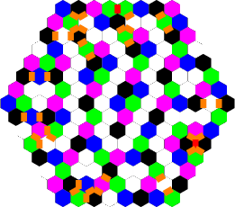

Hexagonal Neighbors
===================

Once again Al has found a fascinating problem worthy of significant effort. Thanks to Al, and congratulations to Tomas Sirgedas (who I first met in an Indian casino in Connecticut in 2002!) for the win.

A sample solution for n=8 is shown here. Cell values for 1..4 are represented by black, green, blue, and purple; values of 5..7 are represented by white, and potential penalty edges are represented by red and orange.

Initially I thought the problem straightforward; it was clear that on an infinite plane a simple periodic tiling would give an optimal score (with an average of three points per cell), so it appeared to be a simple problem of fixing up the boundary of the hexagon. It did not turn out that way. While the key was to fix up the boundary, the best solutions did not exhibit general periodicity.

I used a mix of approaches combined with storing partial solutions to get my high scores. Further investigation led me to realize just using SAT solvers would probably have gotten results more quickly. Thus, this report is essentially reverse chronological, starting with the most effective (and later) approach first, and discussing my earlier methods later.

After having used multiple methods and already found my best solutions, I realized that a simple approach just using a SAT solver would recreate all solutions but one in about six core hours of CPU time. The following table gives invocation commands and execution times to recreate best solutions (essentially from scratch) for all n but 23:

|         n         |    arguments   |   CPU  | Penalty | Score |         n         |          arguments          |   CPU  | Penalty | Score |
|:-----------------:|:--------------:|:------:|:-------:|:-----:|:-----------------:|:---------------------------:|:------:|:-------:|:-----:|
|  [3](hex-3.html)  |     (none)     | &lt;1s |    3    |   39  | [16](hex-16.html) |        -r 4 -I 1 -b 1       |   20s  |    47   |  2023 |
|  [4](hex-4.html)  |     (none)     | &lt;1s |    3    |   87  | [17](hex-17.html) |        -r 4 -I 5 -b 2       |  3326s |    55   |  2297 |
|  [5](hex-5.html)  |     (none)     | &lt;1s |    9    |  147  | [18](hex-18.html) |          -r 4 -b 1          |  1.7s  |    50   |  2602 |
|  [6](hex-6.html)  |    -b 2 -I 4   | &lt;1s |    13   |  227  | [19](hex-19.html) |        -r 4 -I 1 -b 2       |  55.9s |    60   |  2910 |
|  [7](hex-7.html)  |    -r 4 -I 1   | &lt;1s |    17   |  325  | [20](hex-20.html) |        -r 4 -I 2 -b 2       |  842s  |    66   |  3240 |
|  [8](hex-8.html)  |    -r 4 -I 2   | &lt;1s |    20   |  442  | [21](hex-21.html) |        -r 4 -I 4 -b 2       |  2312s |    65   |  3595 |
|  [9](hex-9.html)  |      -r 4      | &lt;1s |    24   |  576  | [22](hex-22.html) |          -r 4 -b 2          |  41.7s |    71   |  3961 |
| [10](hex-10.html) | -r 5 -I 6 -b 2 |  110s  |    28   |  728  | [23](hex-23.html) | -r 4 -b 2 -O 4,5,7,17,19,25 |   30s  |    76   |  4346 |
| [11](hex-11.html) |      -r 4      |  1.6s  |    28   |  902  | [24](hex-24.html) |          -r 4 -b 2          |  12.6s |    75   |  4755 |
| [12](hex-12.html) |      -r 4      |  1.9s  |    32   |  1090 | [25](hex-25.html) |        -r 5 -I 1 -b 1       | 11249s |    81   |  5175 |
| [13](hex-13.html) | -r 4 -I 1 -b 2 |  5.4s  |    40   |  1292 | [26](hex-26.html) |        -r 4 -I 2 -b 2       |  6052s |    87   |  5613 |
| [14](hex-14.html) | -r 4 -I 3 -b 2 |  34.4s |    43   |  1517 | [27](hex-27.html) |        -r 4 -I 1 -b 1       |  443s  |    85   |  6077 |
| [15](hex-15.html) |    -r 4 -b 2   | &lt;1s |    45   |  1761 |                   |                             |        |         |       |

I will describe what the arguments mean later, but for all but n=23, the arguments describe the solution in broad terms and the CPU time given is only somewhat smaller than what would be required to start the search from scratch.

The only computers I used were my Mac laptop and a few oldish Dell servers in my home. I did not use any GPU.

Score by Edge Penalties
-----------------------

Let's consider what the largest value that might be attained by a hexagon of size n. The number of cells in such a hexagon is v=3n(n-1)+1. Any cell value greater than 1 requires an adjacent 1, and each cell has at most 6 neighbors, so for any solution there must be at least ceil(v/7) 1 cells. Of the remaining cells, any cell value greater than 2 requires an adjacent 2, and each cell has at most 5 neighbors that is not used (by being adjacent to a 1), so there must be at least ceil(v'/6) 2s of the remaining v' cells. Continuing this analysis through to 7's and doing a tiny bit of algebra I find an upper limit on the score is floor(v/7)\*21+(v%7)(v%7-1)/2 which is asymptotically equal to 9n(n-1).

This bound can be tightened, simplifying the problem. The above analysis does not take into account that the edge and corner cells have fewer neighbors. I divide the edges between cells into *useful* and *penalty* edges.

Consider a cell with value 7. It has six edges; each of those edges must connect a lower-valued cell to this cell, and the values must be distinct. Each of those edges must be useful, to the cell with value 7.

Consider a cell with value 5. It has six edges. Four of them must connect a lower-valued cell, and those values must be distinct. Those four edges are useful to the cell with the value 5. If the other two edges each connect to a cell with a value higher than 5, they are useful (to the cell neighboring the 5). If the other two edges connect to a cell with a value of 5 or less, they are not useful, and are penalty cells.

A useful edge lies between a lower-valued cell and a higher-valued cell, supporting the higher-valued cell. A penalty edge lies between two equal-valued cell (thus not supporting either), or lies between a lower-valued cell and a higher-valued cell where that higher-valued cell already has some neighbor with the same value as the lower cell. In the example for n=8 above, you'll see two red penalty edges between equal-valued cells; one is in the first row between two green (v=2) cells and the other is in the lower right between two black (v=1) cells. You'll also see orange edges marking locations of duplicated support, such as the two edges in the upper right that mark the two places black cells (v=1) support a single green cell (with v=2). Only one of those two orange edges is actually a penalty edge; I order the edges around a cell in some arbitrary order to break ties and assign the penalty.

It should be clear that the number of useful edges is exactly the same as the final score of the hexagon. Any cell with value 7 has score 6, and requires 6 edges useful to it. Any cell with value 2 can have at most one edge useful to it (an edge connecting an adjacent 1 cell), and this is its score. This gives a tighter upper bound on scores; they are at most the number of edges. The number of vertical edges for a hexagon of size n is (n-1)(3n-2), and the total number of edges is 3(n-1)(3n-2).

Instead of maximizing the score of the hexagon, I minimize the count of penalty edges. This works better than focusing just on the sum of cells because it lets me see where I have made a costly assignment earlier.

Nothing in the analysis above has used the planarity of the graph or the degree of the nodes. Thus, the analysis holds for general graphs, and for general graphs I can state that an upper limit on the score of that graph is the number of edges in the graph.

All results in this paper are with regard to minimizing penalty edges, not maximizing the score. Since the penalty and the score always sum to (3n-3)(3n-2) these are equivalent problems.

Satisfiability Solvers
----------------------

[SAT solvers](https://en.wikipedia.org/wiki/Boolean_satisfiability_problem) have come a long way. Indeed, it is amazing that you can take a concise problem statement (such as the one given for this problem), encode it into SAT (generating megabytes of conjunctive normal form with tens of thousands of variables), and feed it to a SAT solver and get a solution in seconds. I've used SAT solving to great benefit before. It helped Adam Goucher and me find [Sir Robin](http://conwaylife.com/wiki/Sir_Robin) in the Game of Life. In a problem I recently evaluated for a programming contest, all the submitted ad-hoc backtracking solvers were beaten by a generic SAT solver by a factor of over 1,000. If you are not familiar with SAT solving, I recommend Knuth's ["The Art of Computer Programming", Volume 4B Fascicle 6](http://www-cs-faculty.stanford.edu/~uno/fasc6a.ps.gz); you can also get it printed and bound at Amazon. This describes the SAT algorithms, how to encode problems, and I found it approachable and entertaining.

The key to using a SAT solver is often to find a reasonable encoding of your problem in conjunctive normal form.

All the timing results given in this report need to be interpreted cautiously. SAT solvers are opportunistic, and their execution time can be wildly variable over the same problem just by reordering the clauses, or the variables, or using even a slightly different encoding. Comparing encodings or SAT solvers should done statistically. It is easy to make a small change and get a 10x speedup or 10x slowdown on execution time.

SAT encoding
------------

My initial encoding worked as follows.

I introduce a new variable for each permissible value in each cell, so seven variables per cell. These are my primary variables from which the solution is recovered.

I introduce clauses to enforce that at most one variable per cell is true. This requires fifteen clauses.

Then I have clauses enforcing the adjacent value requirements of the contest. For each cell and each value k except the highest possible, I have a clause that asserts either the cell value is less than or equal to k, or one of the neighbors has a value of k. For instance, for a value of 3, I say either the cell has a value of 1 or 2 or 3, or else one of the neighboring cells has a value of 3.

Finally, I sum up the values of the cells using SAT clauses modeling a binary tree of full adders, returning the sum at the top level in a binary value. Then, I simply add clauses asserting this sum is a specific value and run the SAT solver on the result. Since SAT returns a yes/no answer, to calculate a minimum value you need to iterate using binary search or some other approach.

The size of the encoded problem is significant. With this encoding, for n=27 looking for a solution with a score of 6077, the resulting encoding had over 42,000 variables and over 218,000 clauses.

I used [glucose 4.0](http://www.labri.fr/perso/lsimon/glucose/) as my SAT solver (with an incremental patch, and some revisions by me to make it work in a closed-loop situation). (I used the simp, not the parallel, version.)

This SAT encoding on the full problem could find an optimal solution for n=3 in 0.15s and for n=4 in 90s. It would not solve n=5 in any reasonable amount of time. This is much slower than beam search, but unlike beam search if the SAT solver returns a result (either yes or no) it is definitive. If beam search does not find a solution in a given run, that doesn't mean there isn't a solution, just that it has not found one.

Improving the Encoding
----------------------

The first change I made to my SAT encoding is to have it encode and sum penalty edges rather than summing the values assigned to cells. I have to add clauses that reflect the definition of penalty edges, and sum the penalty edges.

First, I added a new variable for each edge indicating that it is a penalty edge. For every edge and every possible cell value except the highest, I added a clause that said if the two cells adjacent to this edge were both that specific value, the edge is a penalty edge. Finally, after ordering the edges, for every pair of edges adjacent to a given cell and every possible cell value except the highest, I added a clause that said if both neighbors were the same value and they were less than the given cell value then the earliest edge in the ordering was a penalty edge.

With this change I no longer needed a variable to encode that a cell had the value 7, and I could also eliminate the clauses that used that variable.

This change caused a significant increase in the size of the encoding, both in variables and clauses. For n=27 looking for a solution with only 85 penalty edges, the final encoding had more than 57,000 variables and over 443,000 clauses. Yet, this encoding was able to solve n=3, n=4, and n=5 in under a second, n=6 in 8s, n=7 in 1.4s, n=8 in 192m, and n=9 in 95m. Encoding size and solve time are frequently not related.

Changing to penalty edges also permitted me to separate levels, doing a single or a few levels at a time. Doing a level k means assigning the locations of cells that have value k, from a grid that already had all assignments for levels less than k, and postponing decisions for cells greater than k. It turned out that the first level was the hardest to do, followed by the second; completing levels three through six in one step usually took around at second, at most. Unfortunately the optimal overall solution often did not use an optimal level-1 or level-2 solution. It turns out, however, that with the SAT solver, doing all the levels at once was usually not much slower than doing just the first level. In addition there was no need to do level 6 (separating 6+s into 6s and 7s) since this could trivially be done in a post-processing phase and can never introduce penalty edges. This allowed me to also remove the variable used to encode that a cell had the value 6, and the clauses related to that variable.

Improving the Cardinality Encoding
----------------------------------

The next step was to try different mechanisms for encoding a limit on the count of penalty edges. Encoding such cardinality constraints is an active area of research. I tried a number of different encodings, and the one that worked the best was to use a [bitonic merge sorting network](https://en.wikipedia.org/wiki/Bitonic_sorter) with depth O(log^2 n). This actually increased the size of the encoding further; for n=27, doing 5 levels, searching for a solution with 85 penalty edges required more than 226,000 variables and more than 535,000 clauses. With this encoding, I solved n=3 through n=5 in less than a second, n=6 in 1.2s, n=7 in 109s, and n=8 in 635s. I did not solve n=9 faster than in the previous encoding, probably due to unpredictability of SAT solving times.

Breaking Symmetry
-----------------

This problem has the 12 symmetries of the hexagon, so breaking the symmetry in some way can speed up the SAT solver. I broke symmetry in this problem by placing two 1 cells in specific places in the center of the hexagon. In any solution, there will be a 1 cell in the very center of the hexagon, or in a cell adjacent to the very center. In my encoding program, the -b 1 option placed a 1 cell in the very center and another one a short distance away; the -b 2 option placed a 1 cell in a specific cell adjacent to the center, and another one a short distance away. In both cases this forcing of two specific 1 cells broke the symmetry of the hexagon. With this change I was able to find optimal solutions for n=3 through n=5 in less than a second, n=6 in 2.3s, n=7 in 21s, n=8 in 160s, n=9 in 38m, n=10 in 169m, and n=11 in 92m.

The placement of the 1 cells was derived by observing that the 1 cells are located in a regular pattern in the interior of almost all the solutions. Misplacing a 1 cell located near the center of the hexagon relative to one of its nearby 1 cells incurs many penalty edges, since there's only one good way (modulo symmetries) to connect clusters of seven hexagons to tile the plane. This does exclude a portion of the search space, but it is a portion that is unlikely to have any good solutions.

Bounds on Penalties in Rings
----------------------------

The approach described so far still led to SAT problems that were too big to be solved for n&gt;12. Looking at the solutions I had from other algorithms (to be described), it appeared that most of the penalty edges were towards the edges of the hexagon. Exploiting this allowed me to get excellent solutions for all sizes relatively quickly using SAT.

I define the set of cells that are on the perimeter of the hexagon to be ring 1, and those adjacent to ring 1 but not in ring 1 to be ring 2, and so on through to ring n which is the single hexagon in the center of the hexagon. A penalty edge that occurs between a cell in ring a and a cell in ring b is said to occur at distance a+b; these distances start at 2 (for penalty edges between two edges in ring 1) and go up to 2n-1 (for penalty edges adjacent to the central cell). I noticed almost all penalty were at distances 2 and 3. I added an -r d parameter to my SAT encoding program that enforced the restriction that all penalty edges had to be at a distance less than d, and all other edges had to be useful.

This dramatically reduced the number of edges that needed to be summed. For n=27, there are 6162 edges, but there are only 156 at distance 2 and 306 at distance 3. (I ordered edges so if there was a choice between assigning a penalty at two distinct distances, I would always assign it to the lower distance). Just this restriction allowed me to find best solutions for n=3, 5, 9, 11, 12, 15, 18, 22, and 24, solutions off best by 1 for n=4, 6, 7, 10, 13, 14, 16, 17, 19, 20, 21, 23, 26, and 27, and solutions off best by 2 for n=8 and 25, with no other information or restrictions; the longest runtimes for the SAT solvers was only a few hours even when I did not specify symmetry breaking information.

This did significantly reduce the space of solutions, however, and it was not finding best solutions for the majority of values of n. So I added another parameter, -I x, which permitted up to x penalty edges could be in edge distances greater than or equal to d, and the rest had to be in the outer ring set by the -r parameter. Larger values of x made the SAT solver work longer and harder. Different values of x partitioned the space, so I could in parallel search several values of x with different runs of the SAT solver. Using this, and also including symmetry breaking as described earlier, I was able to find best solutions for almost all the ones that were not best with x=0. I already had best for n=4, 6, 7, and 10 with just symmetry encoding, so I will omit those here. With x=1 I found best for n=13, 16, 19, and 27; with x=2 for n=20 and 26; with x=3 for n=14; with x=4 for n=21; with x=5 for n=17. For n=25 I had to increase d to 5 and use x=1 to find a best solution.

Adding the x parameter means I am once again summing all edges, so why is this so much faster to solve? The reason probably lies in the fact that the limit on the sum of the majority of the edges is so small. Generating a cardinality constraint of at most k of n things is of size O(n log^2 k). With the d and x parameters, I am generating a cardinality constraint with large k on relative few edges, and with small k (x) on many edges; the resulting clause set is smaller and apparently more amenable to solution with the SAT solver.

To deterministically recreate the solutions from scratch (assuming nothing except a reasonable center placement of 1 cells) you simply find the best solution you can with d=4 and x=0 by iterating down in penalty edge count, using both b=1 and b=2 in parallel. Once you get a value that is unsatisfiable, you increase x and try to find a lower penalty edge count. You keep increasing x until you get to SAT problems that the solver cannot handle in a reasonable amount of time. This approach lets you find all the best values except n=23 in little CPU time.

For n=23 I had to fall back to my prior methods (described later), and use information gleaned from that solution to generate specific details for SAT encoding. Specifically, the -O option takes a list of edge distances at which to permit a single penalty edge. All n=23 solutions I have been able to find have too many internal penalty edges for any setting of d and x to find a solution in less than a day of CPU time.

I continue to burn CPU with d=4 and d=5 and increasing values of x to search for even better solutions, but have not found any improvements since late December. I have proved the results for n=3 through n=11 are overall optimal (again using the SAT solver) but have not proved that results for n=12 through n=27 are optimal.

Level by Level
--------------

Now I will discuss my earlier approaches. These also used SAT but only for some levels, and I used beam search for levels 1 and 2, and a simple ad-hoc linear-time solver for levels 5 and 6. Here I discuss how the levels are separated, motivated by an example.

Recasting the problem to use penalty edges lets me assign node values in order of increasing value. First I identify all the nodes that I want to be 1s, ensuring that every remaining node is adjacent to at least 1. This is the first "level". I can immediately see any penalty edges that go from a 1 to any other value at this point, and for any given assignment of 1s I can immediately assign a maximum score (or minimum penalty) from this assignment.

Consider a sample grid for n=3. In this grid I use 2s to indicate cells that will be given values of 2 or greater, and 1s to indicate cells that I immediately and permanently assign a 1 to.

      2 1 2
     2 2 2 2
    1 2 2 1 2
     2 2 2 2
      2 1 2

In this grid, all the cells marked 2 are adjacent to at least one marked 1, so it is a legal assignment. I immediately can mark two penalty edges, since there are two 1s adjacent to two of the 2s. This is the fewest number of penalty edges possible when assigning 1s (and this is the unique solution with only two penalty edges; all other solutions have five or more penalty edges.

Next I can place the 2s, leaving the 1s fixed and marking all cells that will have a value of 3 or greater with a 3. This is the same as the initial problem, but now I remove all the cells that are marked with 1, leaving me with this hexagon (where the x's mean removed nodes and the question marks mean nodes to determine):

      ? x ?
     ? ? ? ?
    x ? ? x ?
     ? ? ? ?
      ? x ?

The best I can do is as follows (after combining it with the original input):

      3 1 3
     3 2 3 2
    1 3 3 1 3
     3 3 3 3
      2 1 2

This is legal because every 3 has at least one 2 adjacent. There is a single additional penalty edge due to one of the 3s being supported by more than one 2, but this is unavoidable at this size. So the penalty edges total 3 at this point. There are other assignments with higher penalties.

I continue in this fashion. Assigning 3's gives me this grid:

      3 1 4
     4 2 3 2
    1 4 4 1 4
     3 4 4 3
      2 1 2

This is a perfect assignment; no 4 is supported by more than one 3, and no 3s are adjacent, so the penalty sum is still 3. I continue by assigning 4s, 5s, and 6s (any remaining cells are 7s); none of these steps introduces penalty edges, so I end with the grid

      3 1 4
     4 2 3 2
    1 6 5 1 4
     3 7 4 3
      2 1 2

This is a tiny example but it's already instructive. Most of the penalty cells were introduced in the first step---this is typical, even for larger n. For my solution at n=27, 68 of the final 85 penalties were introduced at the first level. In this example, no penalties were introduced in levels 3, 4, 5, or 6. For all the optimal solutions I submitted, there were no penalty edges introduced at levels 4 or higher; all the penalties edges were in place after assigning the 3s.

This does not mean that I can always assign 4s or 5s without introducing penalty edges, but I frequently can. And I can never introduce a penalty edge when assigning 6s.

Let's switch from low values up, to high values down. Assigning 6s is easy; I locate a pair of adjacent 6+s and make either of them a 7. (This shows that there are an exponential number of optimal solutions, since adjacent 6s and 7s can be swapped). There never can be a 6 or higher cell adjacent to more than one 6 or higher cell, because that 6 cell requires 5 support edges.

Assigning 5s is also straightforward. Once I've assigned 4s, the remaining 5+s can have at most two neighbors that are also 5+s each, so they form chains or cycles. It turns out a chain can always be optimally filled without any additional penalty edges, and any cycle that has a length that is a multiple of 3 can be filled without penalty edges. Any cycle that is not a multiple of 3 requires the introduction of a single penalty edge. So once I have assigned 4s, analyzing the 5+s to determine the minimum penalty is a linear-time operation. While most good solutions after assigning 4s do not permit penalty-free completion, enough of them do that you can pretty much focus on just finding a good assignment of 1s, 2s, 3s, and 4s.

The following table gives the lowest number of penalty edges total through each level I have been able to find. The results are optimal through n=16 for level 2, through n=12 for level 3, and through n=11 for all higher levels. Note that levels 4, 5 and 6 are always identical.

|  n  |  1  |  2  |  3  | 4,5,6 |  n  |  1  |  2  |  3  | 4,5,6 |
|:---:|:---:|:---:|:---:|:-----:|:---:|:---:|:---:|:---:|:-----:|
|  3  |  2  |  3  |  3  |   3   |  16 |  36 |  44 |  46 |   47  |
|  4  |  0  |  2  |  3  |   3   |  17 |  40 |  51 |  55 |   55  |
|  5  |  7  |  8  |  9  |   9   |  18 |  36 |  46 |  50 |   50  |
|  6  |  10 |  12 |  13 |   13  |  19 |  45 |  56 |  60 |   60  |
|  7  |  12 |  15 |  16 |   17  |  20 |  48 |  62 |  65 |   66  |
|  8  |  14 |  18 |  20 |   20  |  21 |  50 |  62 |  65 |   65  |
|  9  |  18 |  23 |  24 |   24  |  22 |  53 |  66 |  71 |   71  |
|  10 |  22 |  26 |  28 |   28  |  23 |  54 |  72 |  75 |   76  |
|  11 |  18 |  28 |  28 |   28  |  24 |  58 |  72 |  75 |   75  |
|  12 |  27 |  30 |  32 |   32  |  25 |  54 |  76 |  80 |   81  |
|  13 |  30 |  37 |  40 |   40  |  26 |  63 |  82 |  86 |   87  |
|  14 |  32 |  40 |  43 |   43  |  27 |  66 |  81 |  84 |   85  |
|  15 |  35 |  43 |  45 |   45  |     |     |     |     |       |

Summing over all the best 25 solutions I submitted, 850 penalty edges were at level 1, 219 penalty edges were at level 2, 54 penalty edges were at level 3, and no penalty edges were at level 4, 5, or 6. Over 95% of the penalty edges were in the first two levels. Not all my solutions that were optimal overall used optimal level-1 or level-2 or even level-3 solutions; for instance, at n=7, there are level-3 solutions with only 16 penalty edges, but none of them yield level-4 solutions with 16 penalty edges. The optimal level-4 (and final) solutions at n=7 have 17 penalty edges.

This also helps me prove solutions optimal more easily. If I know there are no level 3 solutions with fewer than 13 total penalty edges at n=6, then clearly there are no ultimate (level 6) solutions with fewer than 13 total penalty edges, so I only need to do the first three levels for that proof. Indeed, for n=11, I proved there were no level 2 solutions with fewer than 28 penalty edges, and I was able to find a final (level 6) solution with 28 penalty edges, so I know the optimal result for n=11 is 28 even though I only needed to consider placing 1s and 2s and ignore how the 3+s were allocated among the 3s, 4s, 5s, 6s, and 7s.

Solution Counts
---------------

One interesting question that arises is how many optimal solutions are there for a given n and level. For small n this can be found, and the results may be surprising. For levels 4, 5, and 6, it is very common for there to be a large number of local choices (such as picking which of a pair of 6+s should be a 7) for where choosing between two cells yields fully equivalent solutions. For instance, a loop of 3 5+s can be assigned the values 5, 6, and 7 in 6 different ways, so every such loop multiplies the number of solutions by 6.

The solution counts here were found for levels 5 and 6 by calculating all solutions at level 4 that had a penalty less than or equal to the best, and then doing an analysis to see how many ways there were to split the 5+'s into 5s, 6s, and 7s.

|   n  |   1  |  2  |  3  |    4   |     5    |       6      |
|:----:|:----:|:---:|:---:|:------:|:--------:|:------------:|
|   3  |   6  |  48 |  36 |   24   |    72    |      144     |
|   4  |   2  |  6  |  28 |   48   |    288   |     1152     |
|   5  |  84  |  48 | 360 |   948  |   17820  |    468864    |
|   6  |  36  |  58 | 276 |  4128  |   16992  |    2506752   |
|   7  |  96  | 432 | 360 | 410832 | 63132480 | 135214596096 |
|   8  |  48  |  24 | 468 |  30720 | 11197440 | 733835427840 |
|   9  |  136 | 432 |     |        |          |              |
|  10  | 2496 |     |     |        |          |              |
|  11  |  128 |     |     |        |          |              |
|  12  | 9216 |     |     |        |          |              |
| 13 1 | 8560 |     |     |        |          |              |

Algorithms
----------

Finding an assignment at each level is known as a set cover problem. To find a penalty-free assignment is equivalent to the exact cover problem; to find a minimum-penalty assignment is similar but not exactly equivalent to the minimum-weight set cover. If the degree of the underlying graph is 3 or more, as it is when assigning 4s or lower, set cover is NP-complete, even when the graph is planar. Yet there are fairly effective algorithms in practice. These include dancing links, integer linear programming, and satisfiability. I also used beam search as an ad-hoc algorithm that frequently performs reasonably well.

I coded up programs to recast any single or multiple levels (i.e., assigning 1s 2s and 3s as a single step) using beam search, using SAT, and using dancing links, and compared them. Some of the variations of beam search used different search orders to try to exploit the regularity I saw in many solutions, or to exploit the spatial distribution of penalty edges in various ways. In all my programs I could read in a partial solution at a given level and use it as a base to do the next level or the next several levels.

In my initial experience, assigning 1s and 2s was best done with beam search. Assigning 3s and 4s was best done with SAT solvers (assigning 4s using a SAT solver was almost instantaneous; assigning 3s usually took under a second). Assigning 5s and 6s was trivially done as described above by simple graph theory. Interestingly, using the SAT solver to assign 3s, 4s, 5s, and 6s all at the same time usually required about the same amount of time to just assign 3s; this let me do all of the last four levels at once.

Surprisingly to me, using SAT solvers was faster than dancing links (using Knuth's code) even when I only asked for exact covers; this is probably because there are SAT solver competitions yielding good open-source SAT solvers, but no such competition exists for dancing link solvers. Or perhaps the SAT-solver built-in simplifiers were reducing the problem in a way that dancing links was not able to.

Storing Partial Solutions
-------------------------

Originally I stored partial solutions at each level independently and literally in text files, one text file for each n and aggregate penalty-so-far. As these got too large, I switched to row3 files. The row3 files contained each possible chunk of three consecutive rows (including special "empty" rows for the first and last real hexagon rows); a simple dynamic-programming problem allowed me to reconstruct (and/or count) the good solutions from these row files. In addition, the row3 files allowed me to combine rows that were useful across sizes; for instance, a row3 consisting of rows of sizes 16,17,18 could potentially be used in hexagons from sizes n=10 through n=16. These row3 files provided incredible compression in my storage of partial solutions and allowed me to generate new partial solutions from parts of existing partial solutions. In addition, I was able to generate new useful row3 entries by building a good partial solution from the existing row3 entries, rotating it 60 or 120 degrees, and decomposing the resulting hexagon into new row3 entries.

As an example, there are 410,832 solutions for n=7 after assigning 4s with a penalty of only 17; these take about 85MB when written out in my explicit textual format. When stored in row3 format, there are only 8,706 row3 entries, requiring only 370K in text format. The compression only increases with n. At n=27 after assigning level 3, my 63MB row3 file (shared across all n values) generates 1,990,656 penalty=84 solutions and 478,676,736 penalty=85 solutions, which would require 1.4TB to store in my old format.

Admittedly, the row3 entries are reduced by four symmetries, while the 410,832 entries above are not reduced by any symmetries, but this is a small fraction of the total compression.

Beam Search
-----------

For many problems, including so many of the Al Zimmermann competitions over the years, just a simple straightforward [beam search](https://en.wikipedia.org/wiki/Beam_search) yields good results. Essentially, you build a pool of partial results, and consider all single-step extensions, building a new pool with further-defined results, and iterate. A good beam search solver depends on fast evaluation of fitness, a reasonable fitness function (here I just used count of penalty edges), some amount of randomization (so different runs explore different areas of the search space), lots of memory, and a good ordering of construction of the solutions (that is, what cells do I consider in each step).

To make good use of memory a nice tight encoding is useful; my code compressed each cell value into the fewest number of bits required, so if I was doing only a single level, only one bit would be required for each cell. If I was doing two or three levels at once, two bits would be required; otherwise, three bits would be required.

To calculate penalties quickly I used a lookaside cache that let me calculate all the penalties for all assignments to a given cell if I had seen a similar situation before; this cache gave me greater than a 99% hit rate and let me exploit gigabytes of memory with pool sizes in the hundreds of millions for my searches.

For planar graphs such as this a row-by-row evaluation order generally works well, and I did try that, but I found that a clock-based evaluation order generally worked better. In this evaluation order, I evaluated cells according to their angle from the positive x axis, treating the center of the hexagon as the origin. I have no formal explanation for why this worked better than row-by-row. I tried a number of other orderings, finally settling on a spiral-from-the-center through a particular size followed by a clock-based ordering of the remaining cells as the best. I ran some very large beam searches, requiring more than 40GB of memory and more than a day of CPU time, for each size.

In general I found that beam search worked well when assigning level 1, finding many optimal solutions quickly, but generated so many solutions that it was hard to manage level 2. I found combining level 1 and 2 in a big-memory beam search worked best, allowing me to eliminate those level 1 solutions that were not useful to level 2, but I did have to run with gigabytes of memory. Trying to use beam search to do combined level 1, 2, and 3 generally did not work well; it was better to generate a number of good solutions with beam search at combined level 1 and 2, and use SAT to extend those solutions to level 3 (and 4).

Other Programs
--------------

I also wrote plenty of other solvers. One was a straightforward backtracking solver for the smaller sizes. Another used row-by-row dynamic programming. Both my beam search solver and my SAT encoder/decoder supported arbitrary partial solutions, so I had a program that took a solution, blanked out a large region of it (even to the point where there was only a single row left) and solved it again looking for an improvement; this incremental approach gave me some of my best early results.
